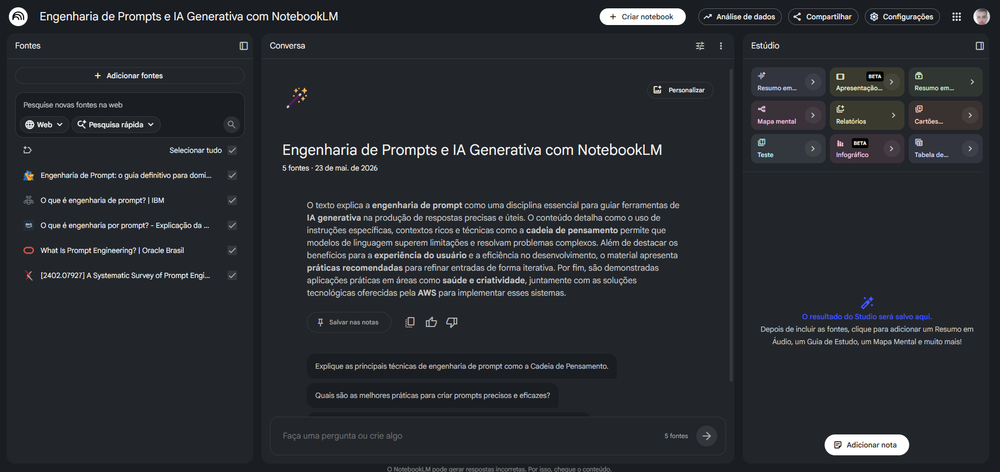
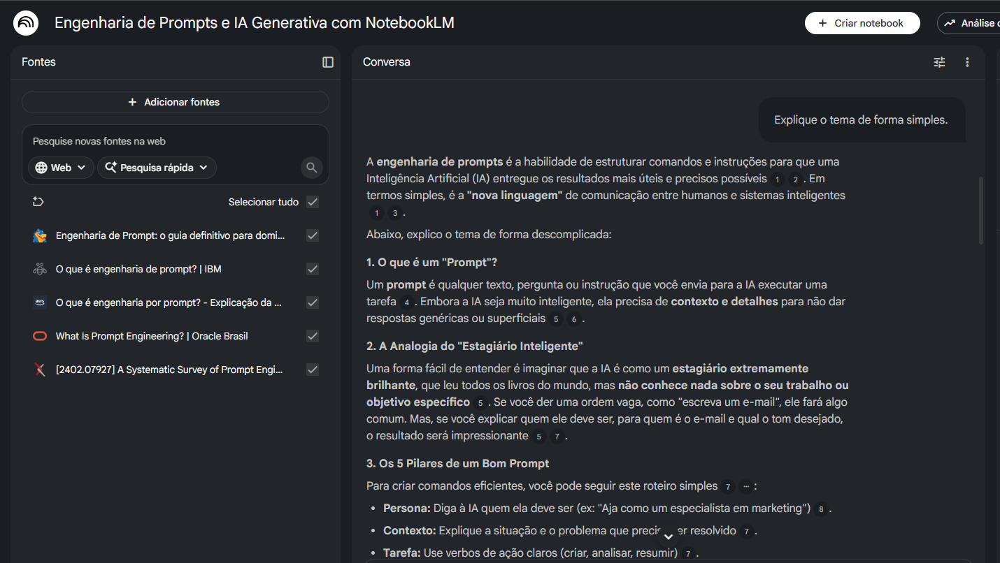
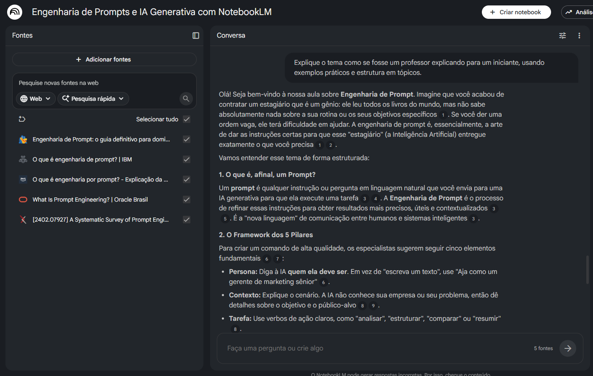
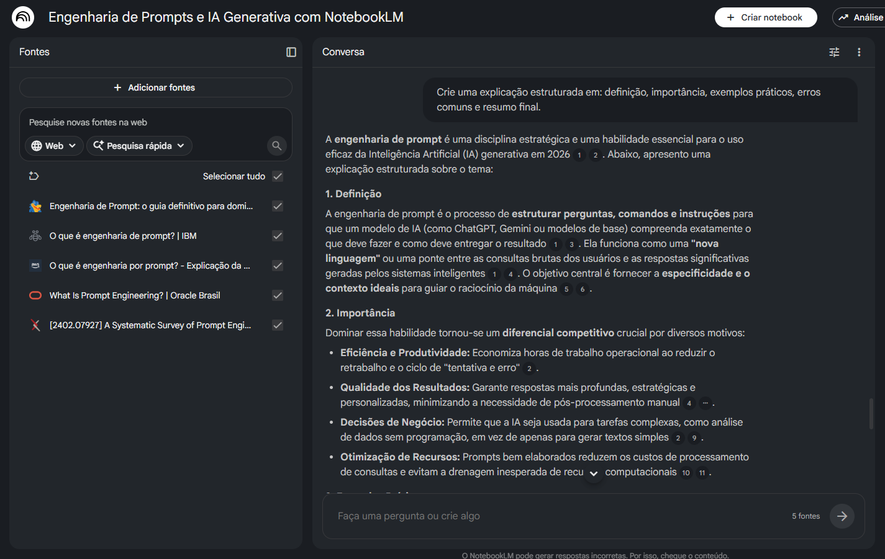

# 📚 Engenharia de Prompts e IA Generativa com NotebookLM

  
  
  
  
  
  

## 🎯 Contexto e Objetivos

Este projeto tem como objetivo explorar o uso da Inteligência Artificial como ferramenta de aprendizagem ativa, utilizando o NotebookLM para organizar, sintetizar e aprofundar o estudo de um tema específico.

O tema escolhido para este caderno temático foi:

> **Engenharia de Prompts e IA Generativa**

### 📌 Objetivos do estudo

- Compreender os conceitos fundamentais de Engenharia de Prompts e IA Generativa
- Explorar fontes confiáveis e estruturadas
- Utilizar IA para síntese e organização do conhecimento
- Desenvolver habilidades de engenharia de prompts
- Criar um material de estudo reutilizável (miniguia)

---

## 📖 Curadoria de Fontes

As fontes abaixo foram selecionadas para construção do caderno temático no NotebookLM:

1. [O que é engenharia de prompts? - IBM](https://www.ibm.com/br-pt/think/topics/prompt-engineering)

2. [O que é engenharia de prompts? - AWS](https://aws.amazon.com/pt/what-is/prompt-engineering/)

3. [Engenharia de Prompt: o guia definitivo para dominar a Inteligência Artificial em 2026 - Hostgator](https://www.hostgator.com.br/blog/engenharia-de-prompt/)

4. [What Is Prompt Engineering? A Guide - Oracle](https://www.oracle.com/br/artificial-intelligence/prompt-engineering/)

5. [A Systematic Survey of Prompt Engineering in Large Language Models: Techniques and Applications - arXiv](https://arxiv.org/abs/2402.07927)

📌 Todas as fontes utilizadas são abertas e de acesso público.

---

## 🤖 Engenharia de Prompts e “Cicatrizes”

Durante o processo, foram testadas diferentes abordagens de prompts para melhorar a qualidade das respostas geradas pela IA.

### 🧪 Prompt inicial

> Explique o tema de forma simples.

**Resultado:** resposta muito genérica e superficial.

---

### 🔧 Prompt aprimorado

> Explique o tema como se fosse um professor explicando para um iniciante, usando exemplos práticos e estrutura em tópicos.

**Resultado:** resposta mais clara, didática e organizada.

---

### 🚀 Prompt avançado

> Crie uma explicação estruturada em: definição, importância, exemplos práticos, erros comuns e resumo final.

**Resultado:** respostas mais completas, organizadas e aprofundadas.

---

### ⚠️ Dificuldades encontradas

- Respostas genéricas em prompts muito simples
- Necessidade de contextualizar o nível de conhecimento esperado
- Importância de definir formato e objetivo da resposta
- Necessidade de refinamento contínuo dos prompts

---

## 📘 Miniguia de Estudo (Entrega Final)

### 🧩 Resumo do tema

A Engenharia de Prompts é a prática de estruturar, testar e otimizar instruções para modelos de Inteligência Artificial generativa, com o objetivo de obter respostas mais precisas, úteis e contextualizadas.

Com o avanço dos Large Language Models (LLMs), como ChatGPT e Gemini, tornou-se essencial compreender como formular prompts adequados para diferentes cenários, desde tarefas simples até aplicações profissionais.

Durante este estudo, foram exploradas técnicas como:

- Zero-shot Prompting
- Few-shot Prompting
- Role Prompting
- Chain-of-Thought

Também foi possível observar que prompts bem estruturados influenciam diretamente a qualidade das respostas, reduzindo ambiguidades e aumentando a eficiência da interação com a IA.

---

### 🚀 Os 5 pilares de um prompt eficiente

#### 👤 Persona

Define o papel que a IA deve assumir.

Exemplo:

> “Aja como um professor especialista em IA.”

---

#### 📚 Contexto

Fornece informações relevantes sobre o cenário ou objetivo.

---

#### ✅ Tarefa

Define claramente o que deve ser executado.

Exemplo:

> “Explique os conceitos principais em tópicos.”

---

#### 📄 Formato

Determina como a resposta deve ser organizada.

Exemplo:

- tabela
- lista
- resumo
- passo a passo

---

#### 🔄 Iteração

Processo contínuo de refinamento para melhorar os resultados.

---

### 🛠️ Técnicas utilizadas

- **Zero-shot Prompting:** nenhuma demonstração é fornecida ao modelo.
- **Few-shot Prompting:** utilização de exemplos para orientar respostas.
- **Chain-of-Thought:** incentivo ao raciocínio passo a passo.
- **Role Prompting:** atribuição de papéis específicos ao modelo.

---

### 📌 Principais conceitos

- **Prompt:** instrução enviada para a IA executar uma tarefa.
- **IA Generativa:** tecnologia capaz de criar conteúdos automaticamente.
- **LLM (Large Language Model):** modelos treinados com grandes volumes de dados textuais.
- **Role Prompting:** técnica em que a IA assume um papel específico.
- **Few-shot Prompting:** técnica baseada em exemplos.

---

### 📚 Glossário

- **Token:** unidade básica de texto processada por modelos de IA.
- **Context Window:** limite de contexto que o modelo consegue analisar.
- **Hallucination:** geração de informações incorretas pela IA.

---

### 🧠 Prompts reutilizáveis

- “Explique Engenharia de Prompts e IA Generativa de forma simples com exemplos reais.”
- “Resuma Engenharia de Prompts em tópicos para revisão rápida.”
- “Quais são os principais erros em Engenharia de Prompts?”
- “Crie um guia passo a passo sobre Engenharia de Prompts para iniciantes.”
- “Explique Engenharia de Prompts como um professor especialista.”
- “Compare zero-shot prompting e few-shot prompting em formato de tabela.”
- “Liste boas práticas relacionadas à Engenharia de Prompts.”

---

## 🛠️ Ferramentas utilizadas

- NotebookLM
- GitHub
- Markdown

---

## 📸 Evidências do Processo

### NotebookLM

---

### Testes de Prompts

---

---

## 🚀 Conclusão

Este projeto demonstrou como a Engenharia de Prompts influencia diretamente a qualidade das respostas em modelos de IA generativa.

Através de testes práticos, foi possível observar que pequenas alterações na estrutura dos prompts impactam significativamente o nível de precisão, organização e utilidade das respostas.

Além disso, o uso do NotebookLM permitiu consolidar o aprendizado de forma estruturada e baseada em fontes confiáveis.
